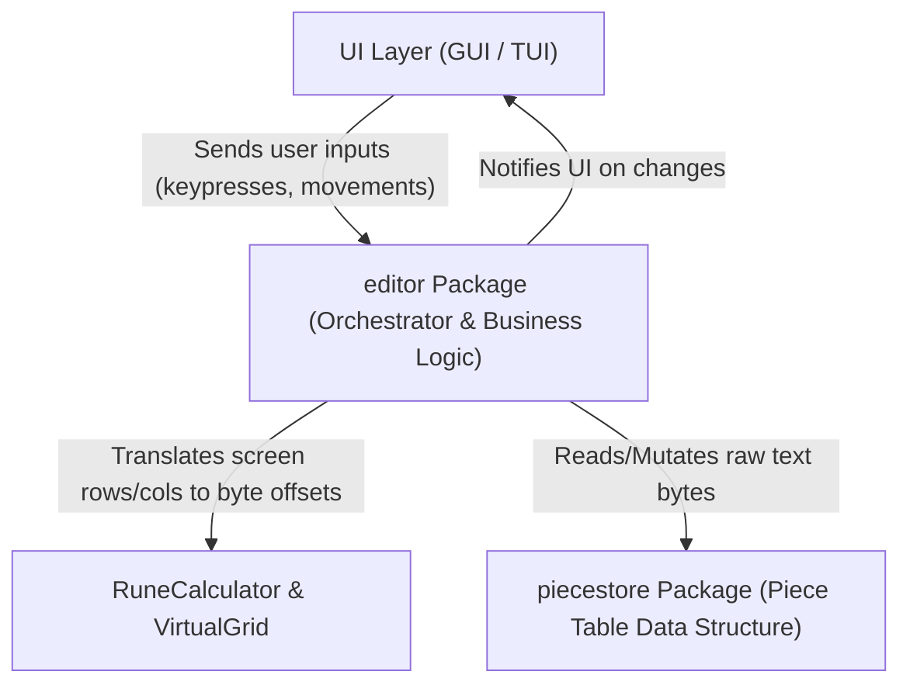

# Conceptual Guide & Mental Model

This document is a high-level, human-readable breakdown of how the text editor engine works under the hood. It skips UI details (GUI/TUI) and focuses purely on **how text is stored, navigated, modified, and orchestrated**.

---

## 1. High-Level Overview: The Big Picture

The editor engine is divided into two distinct responsibilities:



1. **`piecestore` (The Raw Storage Engine)**: 
   Knows **nothing** about screen positions, rows, columns, cursors, or Vim modes. Its sole job is to manage raw text bytes efficiently using a **Piece Table** data structure.
2. **`editor` (The Orchestrator & Movement Engine)**: 
   Wraps the `piecestore` and adds human editor concepts: cursors, grid rows/cols, UTF-8 character navigation, Vim modes (Normal/Insert/Visual), thread safety, and UI change notifications.

---

## 2. Deep-Dive: The `piecestore` Package (Data Storage)

### Why not a standard string or byte slice (`[]byte`)?
If you open a 10MB text file and insert a single letter at the beginning of the file, a traditional string/slice requires copying all 10 million bytes in memory on every keystroke. 

### How the Piece Table Works
Instead of modifying original text directly, the `Store` keeps two byte buffers and a list of "Piece" descriptors:

```text
[Master Buffer] -> Read-only original file bytes ("Hello World")
[Add Buffer]    -> Append-only buffer for user edits (" Beautiful")

[Pieces List]   -> A list of slice recipes pointing to Master or Add:
  - Piece 0: Read 6 bytes from Master at offset 0  ("Hello ")
  - Piece 1: Read 10 bytes from Add at offset 0    ("Beautiful ")
  - Piece 2: Read 5 bytes from Master at offset 6  ("World")
```

When combined, reading Piece 0 + Piece 1 + Piece 2 yields: **`"Hello Beautiful World"`**.

### Key Components in `piecestore`

* **`Store` (`store.go`)**:
  * `Master`: Read-only slice containing the initial document text.
  * `Add`: Append-only slice where all newly typed bytes are appended.
  * `Pieces`: An ordered slice of `Piece` structs representing the current text assembly.
  * `History`: Snapshot list used for tracking states.

* **`Piece` (`store.go`)**:
  * `BufferType`: Specifies whether this piece points into `Master` or `Add`.
  * `Start`: Starting byte offset within that buffer.
  * `Length`: Number of bytes spanned by this piece.

* **`Reader` (`reader.go`)**:
  * `CombinePieces()` / `GetText()`: Iterates through all pieces and joins their bytes into a single string.
  * `GetRuneAt(offset)`: Locates which piece contains the given byte offset and decodes the UTF-8 rune starting at that byte.
  * `Len()`: Returns total byte length across all pieces.

* **`Writer` (`writer.go`)**:
  * `Insert(offset, data)`: Finds the piece containing `offset`, splits it into `Left` and `Right` sub-pieces, appends `data` to the `Add` buffer, and inserts a new `Middle` piece between `Left` and `Right`.
  * `Delete(start, length)`: Truncates or removes any pieces (or parts of pieces) falling within the `[start, start+length]` byte range.

---

## 3. Deep-Dive: The `editor` Package (Orchestrator)

The `editor` package brings the raw `piecestore` to life by converting raw byte offsets into interactive editor states.

```text
+-----------------------------------------------------------------------+
|                            Editor Struct                              |
|                                                                       |
|  +-------------------+   +--------------------+   +----------------+  |
|  | *piecestore.Store |   |  *RuneCalculator   |   | *VirtualGrid   |  |
|  | (Raw Text Bytes)  |   | (Bytes <-> 2D Row) |   | (Screen Bounds)|  |
|  +-------------------+   +--------------------+   +----------------+  |
|                                                                       |
|  +-------------------+   +--------------------+                       |
|  |      *Cursor      |   | sync.RWMutex &     |                       |
|  | (Pos & Vim Mode)  |   | change notification|                       |
|  +-------------------+   +--------------------+                       |
+-----------------------------------------------------------------------+
```

### Key Components in `editor`

* **`Editor` (`editor.go`)**:
  * The main controller. Holds locks (`mu sync.RWMutex`) to prevent race conditions between UI drawing and user typing.
  * Emits signal tokens on `change chan struct{}` so UI elements know when to redraw.
  * Handles high-level commands like `InsertText`, `DeleteText`, `MoveCursorUp`, `MoveCursorDown`, `MoveCursorLeft`, `MoveCursorRight`, `SetMode`.

* **`RuneCalculator` (`rune_calculator.go`)**:
  * **The Math Engine**: Translates between a 1D linear **Byte Offset** (0 to file length) and a 2D **Position** (`Row`, `Col`).
  * **UTF-8 Aware**: Handles multi-byte characters. For instance, the character `'界'` takes 3 bytes in memory, but occupies only 1 column on screen.
  * **Line-Ending Aware**: Tracks newline characters (`\n` and Windows `\r\n`).
  * `PositionToByteOffset(doc, pos, anchors...)`: Scans the document to find the byte offset corresponding to line `pos.Row` and column `pos.Col`. Accepts optional anchor offsets to speed up row navigation.
  * `ByteOffsetToPosition(doc, offset)`: Scans from byte 0 to `offset` to calculate what `Row` and `Col` the cursor is sitting on.
  * `MoveLeft` / `MoveRight`: Steps backward or forward by one complete UTF-8 rune rather than single raw bytes.

* **`Cursor` (`cursor.go`)**:
  * Holds the current cursor position: `ByteOffset`, `Row`, `Col`.
  * Holds the current editor mode: `ModeNormal`, `ModeInsert`, `ModeVisual`.

* **`VirtualGrid` (`virtual_grid.go`)**:
  * Handles viewport mapping (translating logical document grid rows/cols into screen view coordinates).

* **`Document` (`interfaces.go`)**:
  * An interface (`GetRuneAt(offset)` and `Len()`) allowing `RuneCalculator` to operate on `piecestore.Store` or test buffers (`ByteDocument`) interchangeably.

---

## 4. Lifecycle Example: What happens when you press 'j' (Move Down)?

1. **User presses 'j' in UI**.
2. **UI calls `editor.MoveCursorDown()`**.
3. **Editor locks mutex** (`e.mu.Lock()`).
4. **Calculates Target Position**: `Row: e.cursor.Row + 1, Col: e.cursor.Col`.
5. **Calls `RuneCalculator.PositionToByteOffset(e.store, targetPos)`**:
   * Scans `e.store` counting newlines (`\n` / `\r\n`) to find the start of the next row.
   * Advances columns until matching `Col` or reaching the end of the line.
   * Returns the new `newOffset` byte index.
6. **Recalculates Screen Position**:
   * Calls `ByteOffsetToPosition` and `VirtualGrid.GetScreenPosition`.
7. **Updates Cursor**: Calls `e.cursor.Update(newOffset, row, col)`.
8. **Unlocks mutex and notifies UI**: Sends event on `e.change` channel.

---

## 5. Refactoring & Feature Extension Map

When you come back to add new features in the future, use this cheat sheet to know where code should live:

| Feature / Goal | Where to implement |
| :--- | :--- |
| **Modal Keybindings & Verb Graphs** | `internal/editor/keymap/` (`graphs.go`, `keymap.go`) |
| **Undo / Redo** | `internal/piecestore/store.go` & `writer.go` (`Undo()`, `History` stack) |
| **File I/O (Open/Save)** | `internal/piecestore/file.go` & `internal/editor/editor.go` (`:w`, `:e`) |
| **Command Mode Prompt** | `internal/editor/cursor.go` (`ModeCommand`) & `internal/tui-base/base.go` |
| **Vim Movement Keys** (`w` for word, `b` for back, `$` for line end) | `internal/editor/rune_calculator.go` & `internal/editor/keymap/graphs.go` |
| **Text Search (`/`)** | New file `internal/editor/search.go` using `Document` interface |
| **Text Selection / Highlight** | `internal/editor/cursor.go` (expanding selection range) & `internal/editor/editor.go` |

---

## 6. Glossary of Terms

* **Piece Table**: Data structure using immutable original text (`Master`) + append-only edit buffer (`Add`) + list of piece pointers (`Pieces`).
* **Byte Offset**: Zero-indexed position in memory byte stream (e.g. byte index 42).
* **Grid Position (`Row`, `Col`)**: 2D coordinate on screen/document (Line number and column character index).
* **Rune**: Go's term for a Unicode code point / character (may be 1 to 4 bytes long).
